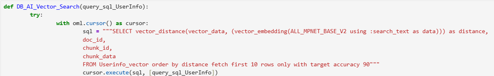
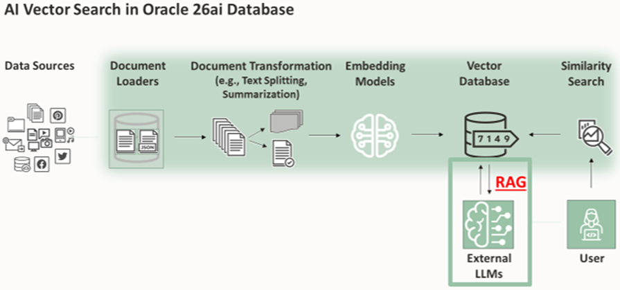

# AI Vector Search and Retrieval-Augmented Generation (RAG)

## Introduction

This lab guides you through the steps to retrieve database rows containing vectors, and the associated data chunks, that are close to the query/prompt in **vector space**. Then, we will use the most relevant text chunks to augment, or enhance, the query/prompt and present it to the LLM which will present a well-formed natural language response. This is the basic Retrieval-Augmented Generation (RAG) approach.

Estimated Time: 40 minutes

### Objectives
In this lab, you will:

- Examine for understanding, then execute the workshop python function "DB\_AI\_Vector\_Search" that you defined in Lab 2, containing Python and SQL code to retrieve records from a vector database based on vector distance from a generalized query or prompt (the "prompt").
- Examine and execute previously defined workshop function "LLM\_Search" which uses a Llama-3.2 multimodal large language model to retrieve a publicly available response to the prompt. This will be our baseline non-RAG response.
- Examine and execute previously defined workshop function "LLM\_Search_using_RAG" which creates a new, enchanced prompt that uses the previous non-RAG response, the top chunks from the database vector search, and custom instructions.

## Task 1: AI Vector Search
In this step, we will take a text, supposedly a question the user is asking re: a relevant business issue, opportunity, etc. and transform it into a vector. We will then feed this vector to the database, where it will be used to retrieve **similar** vectors and associated metadata.
 
### Similarity Search
A similarity search looks for the relative order of vectors compared to a query vector.
The comparison is done using a particular **distance metric**, allowing us to return from the database a result set of the **top closest vectors** along with **the associated data Chunks most similar to the query** .

### Executing the query
Below is an example of the similarity search process in SQL.

The similarity search guery returns the **vector\_data** , **doc\_id**, **chunk\_id** and **chunk\_data** columns from the USERINFO\_VECTOR table. It also returns the result of **VECTOR_DISTANCE** as **distance**
1. The SQL language function **VECTOR_DISTANCE** is used to calculate the distance between two vectors. Here, it takes **vector\_data** and **distance** as parameters.
2. **vector_data** contains the embedded vector data derived in Lab 3
3. SQL language function **VECTOR\_EMBEDDING** generates a single vector embedding for multiple data types using machine learning models. Here, we use the sentence transformer model **ALL\_MPNET\_BASE\_V2** used in Lab 3 to generate the embedding, using a plain text string.
4. The prompt from Lab3 is used as the VECTOR\_EMBEDDING 'USING' parameter. 
The similarity search guery returns the top ten rows from USERINFO\_VECTOR in ascending **distance** order.  The smallest vector distances between **vector_data** data and the prompt embedding indicates the most similar associated Chunks to the prompt text.

Below is an excerpt of the code, previously defined in "**DB\_AI\_Vector\_Search"** function", you will execute in the workshop

When you have finished examining the python code in the next cell, and ready to Continue, Press 'Shift-Enter' twice, or Click the 'Run Cell' icon above twice to execute the code and move to the next task

## Task 2: Large Language Model Query
- In this step, we will execute the "**LLM\_Search**" function defined in Lab 2.
- A LLM will use our prompt to retrieve a publicly available response from the internat.
- We will use this as a part-1 baseline to compare against a RAG response that we will generate in Task 3.  See an excerpt from LLM_Search below.
- **LLM\_Search** takes the prompt ( <u>query\_sql\_UserInfo</u> ) as a single parameter.

When you have finished examining the python code in the next cell, and ready to Continue, Press 'Shift-Enter' twice, or Click the 'Run Cell' icon above twice to execute the code and move to the next task

## Task 3: Retrieval-Augmented Generation (RAG) Enhanced Query

- In this part-2 step, we will execute the "**LLM\_Search\_using\_RAG**" function defined in Lab 2.
- We have the query returning a response augmented by the database rows returned by AI Vector Search (Retrieval-Augmented Generation or "RAG").
- The response has gained more specificity by adding data only available within the organization. See an excerpt from **LLM\_Search\_using\_RAG** below.

RAG is accomplished, in natural language, by combining the preserved AI Vector Search output from Task 1 ( <u>coalesced_top_rows_UserInfo</u> ) with the the prompt ( <u>query_sql_UserInfo</u> ) to present an LLM response combining publicly available and organization-specific information.

After reviewing the steps and the screenshot, Press 'Shift-Enter' <strong><u>twice</strong></u> or Click the 'Run Cell' icon <strong><u>twice</strong></u> to Execute the LLM\_Search\_using\_RAG function below
Stand by for all results to return...
