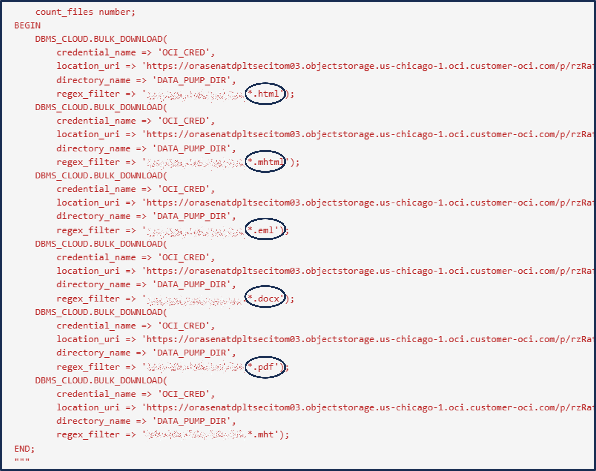
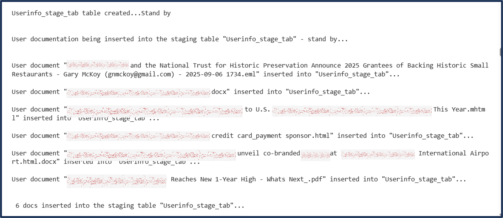

# Embed End-User Business Documents

## Introduction

Depending on the type of your data, you can use different pretrained, open-source models to create vector embeddings. For textual data, sentence transformers transform words, sentences, or paragraphs into vector embeddings.

This lab guides you through the code required to download the ```ALL_MPNET_BASE_V2``` sentence transformer model ingest it into the Oracle AI Database.

## Task 1: Download the Sentence Transformer

Below is an excerpt of the python code to download the sentence transformers model located in the next cell
```python
<copy>
config = ONNXPipelineConfig.from_template("text", max_seq_length=384, distance_metrics=["COSINE"], quantize_model=True)

pipeline = ONNXPipeline(model_name="sentence-transformers/all-mpnet-base-v2", config=config)

pipeline.export2db("ALL_MPNET_BASE_V2")

print("\nONNX-formatted model \"ALL_MPNET_BASE_V2\" loaded into the database...\n\n")
```
<copy>

We are using two Oracle Machine Learning (OML4PY) functions to download and ingest the sentence-transformers

**ONNXPipeline** : Imports the pretrained model, ALL_MPNET_BASE_V2, from **Hugging Face**)

**ONNXPipelineConfig** : Configures the attributes of the pretrained model.  We are using the Cosine distance metric.

- Cosine distance in AI is a measure of how **dissimilar** two vectors are, based on the angle between them

- It is defined as 1−cosine similarity1−cosine similarity, so it ranges from 0 (same direction, maximally similar) to 2 (opposite direction, maximally dissimilar)

When you have finished examining this code and ready to Continue, Press 'Shift-Enter' twice, or Click the 'Run Cell' icon above twice to execute the code and move to the next task

## Task 2: Load Unstructured Data From the Lines of Business


Using embedding models, you can transform unstructured data into vector embeddings that can then be used for semantic queries on business data.

Oracle AI Vector Search semantically searches on unstructured data that can be combined with structured business data searched with traditional relational searches into one response. This operation is called **Retrieval Augmented Generation** or **RAG**.

Retrieval Augmented Generation is an approach developed to address the limitations of Large Language Models (LLMs). RAG combines the strengths of pretrained language models with the ability to retrieve recent and accurate information from a dataset or database in real-time during the generation of responses.
We will first place your documents in cloud object storage and load them into a staging table.

Below is an excerpt of the python code to:
- Retrieve your documents from object storage.
<br>&nbsp;&nbsp;&nbsp;&nbsp;<font size="2">**NOTE:** In your environment object storage can be replaced by file system data storage.</font></br>
- Use SQL to insert these documents into a CLOB column





When you have finished examining the python code in the next cell, and ready to Continue, Press 'Shift-Enter' twice, or Click the 'Run Cell' icon above twice to execute the code and move to the next task

## Task 3: Transform and Embed End-User Business Documents

### The Stages of Data Transformation


Data may travel through different stages before turning into a vector.

Depending on the size of the input data, which can range from small strings to very large
documents, the data passes through a pipeline of optional transformation stages from **Plain
Text** to **Chunks** to **Tokens** to **Vectors**.

The ```DBMS_VECTOR``` and ```DBMS_VECTOR_CHAIN``` packages provides APIs to support these stages with the functions used to:
- Translate user documents to a common Plain Text format
- Extract Chunks from user data based on configurable tokenizing strategies.
- Create vector Embeddings from Chunks or directly from source user data.
- Generating text for a given user query or prompt.
- Generate vector Embeddings from image files using REST API calls to third-party image embedding models.

the ```DBMS_VECTOR_CHAIN``` package is used to chain together the pipeline functions into a single SQL statement - See Below.

<li style="font-family: Arial, sans-serif; font-size: 22px;">Step 1 -> Document Transformation (Green)</li>
<li style="font-family: Arial, sans-serif; font-size: 22px;">Step 2 -> Chunking Large Documents (Purple)</li>
<li style="font-family: Arial, sans-serif; font-size: 22px;">Step 3 -> Embedding ("vectorizing") (Gray)</li>
<li style="font-family: Arial, sans-serif; font-size: 22px;">Step 4 -> inserting vectors into database table (Red)</li>


Below is are excerpts of the workshop python code to retrieve your documents from the staging table, move it through the pipeline and store it in the vector table.


When you have finished examining the python code in the next cell, and ready to Continue, Press 'Shift-Enter' twice, or Click the 'Run Cell' icon above twice to execute the code and move to the next task


